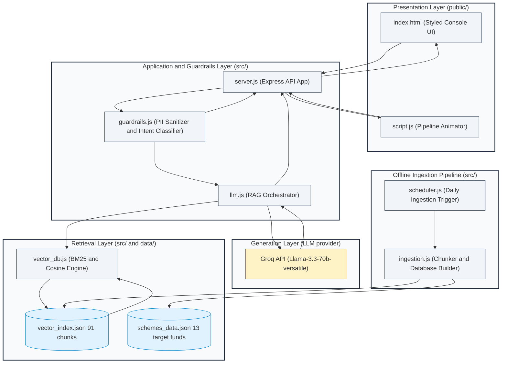
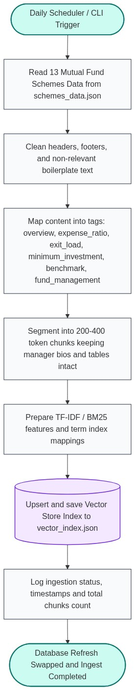
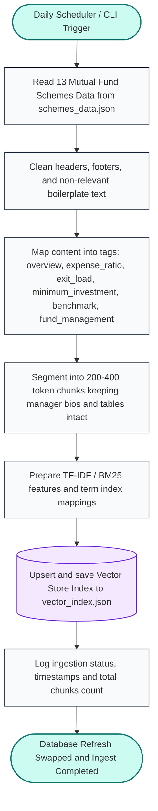
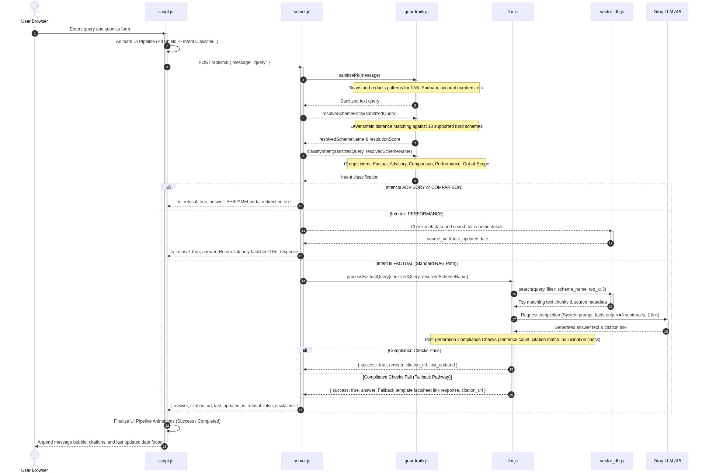
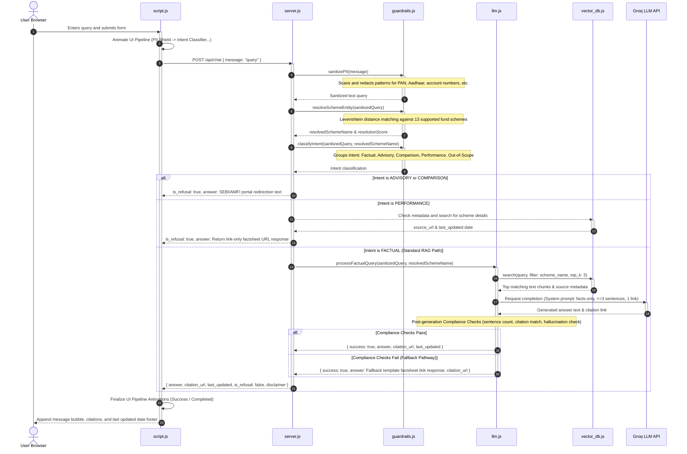

# Architecture: Mutual Fund FAQ Assistant

This document describes the system architecture for a facts-only, RAG-based FAQ assistant scoped to Mutual Fund scheme pages on Groww. It is derived from [problemStatement.md](problemStatement.md).

---

## 1. Design Goals

| Goal | Architectural Implication |
| :--- | :--- |
| **Facts-only answers** | Retrieval grounded in corpus; LLM constrained by system prompt and post-generation validation |
| **Source-backed responses** | Every answer carries exactly one citation URL from the active corpus |
| **Compliance** | Advisory/comparison queries are classified and refused before or instead of retrieval |
| **Accuracy over intelligence** | Prefer retrieved text over model inference; narrow corpus (13 schemes) reduces hallucination risk |
| **Transparency** | Fixed response format: $\le 3$ sentences + citation + `Last updated from sources: <date>` footer |
| **Privacy** | Stateless chat; no PII collection or persistence |

---

## 2. High-Level Architecture

The system follows a Retrieval-Augmented Generation (RAG) architecture. It is divided into an Offline Pipeline and an Online Pipeline.


<details>
<summary><b>View System Architecture Diagram (Alternative Links / Mermaid Code)</b></summary>

*   **Relative Path**: [system_architecture_diagram.png](../images/system_architecture_diagram.png)
*   **Absolute Path**: [system_architecture_diagram.png](file:///C:/AS/PM/Projects/Mutual%20Fund-FAQ/images/system_architecture_diagram.png)
*   **Vector SVG**: [system_architecture_diagram.svg](../images/system_architecture_diagram.svg)


</details>

*   **Request path (online)**: User question → classify → retrieve relevant chunks → generate grounded answer → validate → format → display.
*   **Index path (offline)**: A daily scheduler triggers the ingestion pipeline → fetch Groww pages → parse into structured sections → chunk → embed → persist to vector store and metadata index.

---

## 3. System Components

### 3.1 Presentation Layer (Minimal UI)
A lightweight single-page chat interface inspired by Groww's mutual fund detail pages as reference context.

**Responsibilities**:
*   Display welcome message and disclaimer: `"Facts-only. No investment advice."`
*   Show three clickable example questions (covering scheme facts and fund management)
*   Accept free-text user queries
*   Render assistant replies with citation link and last-updated footer
*   Never prompt for or accept PII (PAN, Aadhaar, account numbers, OTP, email, phone)

---

### 3.2 Application Layer

#### Chat Controller
*   Exposes a single endpoint: `POST /api/chat`
*   Accepts `{ "message": string }` only — no session identifiers tied to identity
*   Routes to classifier, then RAG or refusal path
*   Returns structured JSON for the UI to render:
    ```json
    {
      "answer": "The exit load of Axis Small Cap Fund Direct Growth is 1% if redeemed within 12 months.",
      "citation_url": "https://groww.in/mutual-funds/axis-small-cap-fund-direct-growth",
      "last_updated": "2026-05-29",
      "is_refusal": false,
      "disclaimer": "Facts-only. No investment advice."
    }
    ```

#### Query Classifier
Runs before retrieval to enforce compliance.

| Class | Examples | Action |
| :--- | :--- | :--- |
| **Factual** | Expense ratio, exit load, min SIP, benchmark, fund manager name/tenure/experience | Proceed to RAG |
| **Advisory** | "Should I invest?", "Is this a good fund?" | Refusal handler |
| **Comparison** | "Which fund is better?", "Mid cap vs large cap?" | Refusal handler |
| **Performance-seeking** | "What returns will I get?", "Compare 3Y returns" | Refusal or link-only response to scheme page |
| **Out of scope** | Schemes not in corpus, unrelated topics | Polite refusal with scope explanation |

**Implementation options (in order of simplicity)**:
1. Rule-based keyword/pattern matcher for advisory and comparison phrases
2. Lightweight LLM classification with a fixed label set
3. Hybrid: rules first, LLM fallback for ambiguous cases

#### Refusal Handler
Produces a polite, templated response when classification blocks RAG:
*   States the facts-only limitation.
*   Does not retrieve or invent fund data.
*   Includes one educational link (AMFI or SEBI), e.g.:
    *   [AMFI — Mutual Funds](https://www.amfiindia.com/investor-corner)
    *   [SEBI — Investor Education](https://www.sebi.gov.in/sebiweb/other/OtherAction.do?doSubInvestortab=yes)

#### RAG Orchestrator
Coordinates retrieval, prompt assembly, generation, and validation for factual queries.

#### Response Formatter
Enforces output contract:
*   Maximum 3 sentences in the answer body.
*   Exactly one `citation_url` (must match one of the 13 corpus URLs when answering from corpus).
*   Footer: `Last updated from sources: <date>` where `<date>` comes from chunk metadata (page fetch or parse timestamp), not model inference.

---

### 3.3 Retrieval Layer

#### Corpus (Active)
1. [Axis Silver FoF Direct Growth](https://groww.in/mutual-funds/axis-silver-fof-direct-growth)
2. [Axis Small Cap Fund Direct Growth](https://groww.in/mutual-funds/axis-small-cap-fund-direct-growth)
3. [Axis Liquid Direct Fund Growth](https://groww.in/mutual-funds/axis-liquid-direct-fund-growth)
4. [LIC MF Index Fund Nifty Direct Growth](https://groww.in/mutual-funds/lic-mf-index-fund-nifty-direct-growth)
5. [LIC MF Children's Fund Direct Growth](https://groww.in/mutual-funds/lic-mf-children's-fund-direct-growth)
6. [Baroda BNP Paribas Large & Mid Cap Fund Direct Growth](https://groww.in/mutual-funds/baroda-bnp-paribas-large-mid-cap-fund-direct-growth)
7. [Baroda BNP Paribas Multi Asset Fund Direct Growth](https://groww.in/mutual-funds/baroda-bnp-paribas-multi-asset-fund-direct-growth)
8. [Quantum ESG Best In Class Strategy Fund Direct Growth](https://groww.in/mutual-funds/quantum-esg-best-in-class-strategy-fund-direct-growth)
9. [Quantum Ethical Fund Direct Growth](https://groww.in/mutual-funds/quantum-ethical-fund-direct-growth)
10. [Quantum Dynamic Bond Fund Growth](https://groww.in/mutual-funds/quantum-dynamic-bond-fund-growth)
11. [Zerodha Overnight Fund Direct Growth](https://groww.in/mutual-funds/zerodha-overnight-fund-direct-growth)
12. [Zerodha Nifty 50 Index Fund Direct Growth](https://groww.in/mutual-funds/zerodha-nifty-50-index-fund-direct-growth)
13. [Aditya Birla Sun Life Gold Fund Direct Growth](https://groww.in/mutual-funds/aditya-birla-sun-life-gold-fund-direct-growth)

**Used to**:
*   Resolve which scheme the user is asking about
*   Pre-filter retrieval to a single scheme when detected
*   Attach the correct citation URL

#### Vector Store
Stores embedded text chunks with rich metadata:
*   `source_url`: Citation link
*   `scheme_name`: Scheme disambiguation
*   `section`: e.g. `expense_ratio`, `exit_load`, `fund_management`, `benchmark`
*   `last_updated`: Footer date
*   `chunk_text`: Raw passage for grounding

*Recommended stores for a lightweight build*: Chroma, FAISS, or LanceDB (local, file-backed).

#### Retriever
Two-stage retrieval for better precision on a small corpus:
1.  **Scheme resolution**: Match user query to one of the 13 schemes via slug, name, or alias (e.g. "mid cap", "defence fund") using fuzzy entity matching.
2.  **Semantic search**: Top-k chunks ($k=3\text{–}5$) filtered by `source_url` or `scheme_name`, optionally boosted by section if query intent is detected (e.g. "fund manager" → boost `fund_management`).

Because the corpus is small, a hybrid approach is viable: metadata filter first, then vector similarity/BM25 keyword matching within that subset.

---

### 3.4 Generation Layer

#### LLM (Constrained Generation)
The model receives:
*   **System prompt**: facts-only, no advice, use only provided context, max 3 sentences.
*   Retrieved chunks with source URLs and dates.
*   User question.

**Hard rules in the prompt**:
*   Answer only from retrieved context; if context is insufficient, say so and point to the scheme page.
*   Do not compare funds or compute returns.
*   Do not recommend buy/sell/hold.
*   Include no more than one URL in the answer (formatter extracts citation separately).

#### Output Validator
Post-generation checks before returning to the user:

| Check | Failure Action |
| :--- | :--- |
| **Answer $\le$ 3 sentences** | Truncate or regenerate |
| **Citation URL in allowlist** | Replace with best matching corpus URL from retrieved chunks |
| **No advisory language detected** | Route to refusal template |
| **Grounding**: key facts appear in chunks | Regenerate or fallback to link-only response |
| **Performance numbers not quoted** (unless requested) | Strip or refuse |

---

### 3.5 Offline Ingestion Pipeline
Triggered once per day by the scheduler, or on manual CLI trigger — never on every user query.



<details>
<summary><b>View Daily Ingestion Flowchart (Alternative Links / Mermaid Code)</b></summary>

*   **Relative Path**: [daily_ingestion_flowchart.png](../images/daily_ingestion_flowchart.png)
*   **Absolute Path**: [daily_ingestion_flowchart.png](file:///C:/AS/PM/Projects/Mutual%20Fund-FAQ/images/daily_ingestion_flowchart.png)
*   **Vector SVG**: [daily_ingestion_flowchart.svg](../images/daily_ingestion_flowchart.svg)


</details>

**Ingestion Steps**:
1.  **Fetch**: HTTP GET each corpus URL; store raw HTML or converted markdown with fetch timestamp.
2.  **Clean & parse**: Remove navigation, footers, and duplicate chrome; retain scheme-specific sections.
3.  **Section extraction**: Map content into logical blocks aligned with FAQ query types:
    
    | Section Tag | Example Content |
    | :--- | :--- |
    | `overview` | Category, risk label, AUM, NAV date |
    | `expense_ratio` | Expense ratio value and definition |
    | `exit_load` | Load structure and effective dates |
    | `minimum_investment` | Min SIP, first/second investment |
    | `benchmark` | Benchmark index name |
    | `tax` | STCG/LTCG implications (factual only) |
    | `fund_management` | Manager name, tenure, education, experience, other schemes |
    | `investment_objective` | Stated objective from scheme description |
    | `fund_house` | AMC name, website, incorporation date |

4.  **Chunking**: Section-aware chunks (~200–400 tokens) with overlap only within the same section; keep fund manager bios intact in `fund_management` chunks.
5.  **Embed**: Use a consistent embedding model/algorithm.
6.  **Index**: Upsert into vector store; refresh `last_fetched_at` in metadata index.

---

### 3.6 Daily Ingestion Scheduler
A dedicated scheduler component runs the full ingestion pipeline on a fixed daily cadence so the vector store and metadata index stay aligned with the latest Groww scheme pages.

**Responsibilities**:
*   Trigger ingestion at a configured time each day (e.g. 02:00 UTC / off-peak hours)
*   Invoke the ingestion entrypoint as a single atomic job
*   Log start time, completion status, URLs fetched, and chunk count
*   On failure, record error details and optionally retry once before alerting

**Implementation Options**:
*   *Cron (Linux/macOS crontab or container cron)*: Simple VM / bare-metal deployment
*   *APScheduler (embedded in a worker process)*: Single-process Python deployment
*   *Node.js setInterval / node-cron*: Standard Node.js local scheduler
*   *GitHub Actions scheduled workflow / Cloud scheduler*: Managed environments

```
Metadata Index     Vector Store      Ingestion Pipeline      Daily Scheduler
     │                  │                     │                    │
     │                  │                     │ (Every 24 hours)   │
     │                  │                     │ ─────────────────> │
     │                  │                     │                    │
     │                  │                     │ Trigger ingestion  │
     │                  │                     │ <───────────────── │
     │                  │                     │                    │
     │                  │ Fetch, parse, chunk │                    │
     │                  │ <────────────────── │                    │
     │                  │                     │                    │
     │   Upsert vectors │                     │                    │
     │ <────────────────│                     │                    │
     │                  │                     │                    │
     │ Refresh date     │                     │                    │
     │ <───────────────────────────────────── │                    │
     │                  │                     │                    │
     │                  │                     │ Success/Failure    │
     │                  │                     │ ─────────────────> │
```

The online chat API is not blocked during ingestion; retrieval continues to serve the previous index until the new index is fully written and swapped in.

---

## 4. End-to-End Request Flow

Processes user queries end-to-end through the frontend console to the backend LLM validator:



<details>
<summary><b>View Runtime Query Flow Sequence Diagram (Alternative Links / Mermaid Code)</b></summary>

*   **Relative Path**: [sequence_diagram.png](../images/sequence_diagram.png)
*   **Absolute Path**: [sequence_diagram.png](file:///C:/AS/PM/Projects/Mutual%20Fund-FAQ/images/sequence_diagram.png)
*   **Vector SVG**: [sequence_diagram.svg](../images/sequence_diagram.svg)


</details>

---

## 5. Data Model

### Chunk Record (Vector Store Document)
```json
{
  "id": "axis_small_cap_exit_load_01",
  "text": "The exit load for Axis Small Cap Fund is 1% if redeemed within 1 year...",
  "scheme_name": "Axis Small Cap Fund Direct Growth",
  "source_url": "https://groww.in/mutual-funds/axis-small-cap-fund-direct-growth",
  "section": "exit_load",
  "last_updated": "2026-05-29",
  "embedding": [0.012, -0.043, ...]
}
```

### Chat Request / Response (API Contract)

**Request**:
```json
{
  "message": "Who manages Axis Small Cap Fund?"
}
```

**Response (factual)**:
```json
{
  "answer": "Axis Small Cap Fund is managed by Mr. Anupam Tiwari (since Nov 2016) and Mr. Mayank Hyanki (since Sep 2023).",
  "citation_url": "https://groww.in/mutual-funds/axis-small-cap-fund-direct-growth",
  "last_updated": "2026-05-29",
  "is_refusal": false,
  "disclaimer": "Facts-only. No investment advice."
}
```

**Response (refusal)**:
```json
{
  "answer": "I am a facts-only mutual fund assistant and cannot provide investment recommendations, advice, or buy/sell suggestions. For official investor education, please refer to the SEBI Investor Education page.",
  "citation_url": "https://www.sebi.gov.in/sebiweb/other/OtherAction.do?doSubInvestortab=yes",
  "last_updated": "2026-05-29",
  "is_refusal": true,
  "disclaimer": "Facts-only. No investment advice."
}
```

---

## 6. Query Routing Matrix

| User Intent | Classifier Label | Retrieval | Generation Behavior |
| :--- | :--- | :--- | :--- |
| **Expense ratio of a named scheme** | Factual | Filter by scheme → `expense_ratio` section | State ratio from chunk |
| **Exit load** | Factual | Filter by scheme → `exit_load` section | State load rules |
| **Minimum SIP** | Factual | Filter by scheme → `minimum_investment` section | State amounts |
| **Benchmark** | Factual | Filter by scheme → `benchmark` section | State index name |
| **Fund manager / tenure / experience** | Factual | Filter by scheme → `fund_management` section | List managers and bios factually |
| **Should I invest?** | Advisory | None | Refusal + SEBI/AMFI link |
| **Which fund is better?** | Comparison | None | Refusal + educational link |
| **Expected returns / performance** | Performance | None (Link-only) | Refuse calculation; cite scheme page URL only |
| **Unknown scheme (not in corpus)** | Out of scope | None | Explain limited corpus; list supported schemes |

---

## 7. Technology Stack (Recommended)

| Layer | Options | Rationale |
| :--- | :--- | :--- |
| **Frontend** | Vanilla HTML + JS + CSS | Minimal chat UI, fast to ship, responsive styled console |
| **Backend** | Node (Express) | Express Node.js backend handles lightweight matching and orchestration |
| **Embeddings** | Local Embeddings / Sentence Similarity | Sufficient for small factual chunks; local database persistence |
| **Vector DB** | Custom local JSON database (VectorDB) | Metadata filtering, cosine similarity, reciprocal rank fusion (RRF) |
| **LLM** | Groq Llama-3.3-70b | Cost-effective and highly constrained for factual reasoning |
| **Ingestion** | Custom parser + local JSON file | Clean extraction of facts from scheme pages |
| **Config** | Environment variables (`.env`) | No secrets or keys stored in the repository |

---

## 8. Security, Privacy & Compliance

```
[User Input Query]
        │
        ├── (Check PII patterns: PAN, Aadhaar, Account Numbers, OTP, Email)
        │         ├── Yes ──> Redact / Strip PII values
        │         └── No  ──> Pass through
        ▼
[Classifier Routing]
        │
        ├── (Check intent class)
        │         ├── Advisory / Comparison ──> Static Refusal (SEBI/AMFI Link)
        │         └── Factual ───────────────> RAG Pipeline
        ▼
[RAG Verification]
        │
        └── (Output check: <= 3 sentences, 1 citation link in allowlist)
                  ├── Fails ──> Safe Fallback Link Response
                  └── Passes ─> Deliver Response to Frontend
```

*   **Stateless API**: No user accounts, chat history persistence, or analytics tied to identity.
*   **Input Sanitization**: Reject or strip patterns resembling PII (PAN, Aadhaar, account numbers, OTP, email, phone) before LLM call.
*   **Allowlist Citations**: Validator ensures answer citations are corpus URLs (or fixed AMFI/SEBI URLs for refusals).
*   **No Training on User Data**: Queries are not used to fine-tune models in this phase.
*   **Rate Limiting**: Basic per-IP limits to prevent abuse and cost overrun.

---

## 9. Deployment Topology

*   **Development (local)**:
    ```
    [Browser] ──> [Express Server (localhost:3000)] ──> [Local Vector DB (disk)] ──> [LLM API (Groq)]
                           ▲
                    [Daily Scheduler] ──> [Ingestion Script]
    ```
*   **Production (minimal)**:
    ```
    [Browser] ──> [Static UI (CDN/Vercel)] ──> [API Container] ──> [Vector DB volume]
                                                    │
                                              [LLM Provider]
    ```

---

## 10. Non-Functional Requirements

| Attribute | Target |
| :--- | :--- |
| **Latency (p95)** | < 5 s end-to-end (including LLM) |
| **Availability** | Best-effort for demo; no SLA in phase 1 |
| **Corpus size** | Scoped to 13 Groww URLs; ~100–150 chunks total |
| **Ingestion cadence** | Daily scheduler trigger (automatic corpus refresh) |
| **Answer length** | $\le 3$ sentences + 1 link + footer |
| **Observability** | Log query class, scheme resolved, retrieval scores, refusal rate (no PII) |

---

## 11. Known Limitations

1.  **Corpus Scope**: Limited strictly to 13 Groww mutual fund schemes. Questions about other funds will result in an out-of-domain refusal.
2.  **Source Freshness**: Content depends on the daily crawl cycle. Intraday changes to scheme parameters (like sudden AUM shift) are reflected on the next schedule refresh.
3.  **Third-Party Source**: The scraper relies on Groww's page structures. Structural updates on Groww pages may require parser updates.
4.  **No Performance Analytics**: Assumes no past performance comparison logic; only references raw facts sheets.
5.  **Scheme Disambiguation**: Queries with multiple ambiguous references (e.g. "Axis fund") will ask for clarification.

---

## 12. Future Extensions (Out of Current Scope)

*   Expand corpus to 15–25 official AMC / AMFI / SEBI URLs.
*   Add clarification turn: "Which scheme did you mean?".
*   Structured extraction cache (JSON facts per scheme) for numeric fields like expense ratio.
*   Multilingual support (Hindi).
*   Admin dashboard for ingestion status and chunk inspection.

---

## 13. Project Structure

```
m2_4/
├── docs/
│   ├── problemStatement.md
│   └── architecture.md          # this document
├── data/
│   ├── raw/                     # fetched HTML/markdown per URL
│   ├── processed/               # parsed sections & chunks
│   └── index/                   # vector store files
├── ingestion/
│   ├── fetch.py
│   ├── parse.py
│   ├── chunk.py
│   ├── index.py
│   └── run.py                   # Ingestion entrypoint
├── scheduler/
│   └── daily.py                 # Daily trigger wrapper
├── app/
│   ├── main.py                  # API Entry
│   ├── classifier.py
│   ├── retriever.py
│   ├── generator.py
│   ├── validator.py
│   └── formatter.py
├── ui/
│   └── index.html               # Minimal chat UI
├── config/
│   └── corpus.yaml              # 13 URLs + scheme metadata
├── tests/
│   └── ...                      # Integration tests
└── README.md
```

---

## 14. Summary

The Mutual Fund FAQ Assistant is a small-corpus, compliance-first RAG system. A query classifier gates advisory and comparison questions before retrieval. Factual questions flow through scheme-aware retrieval over 13 indexed Groww pages, grounded LLM generation, and a strict response formatter that enforces brevity, a single citation, and a last-updated footer. A daily scheduler triggers the offline ingestion pipeline to keep embeddings and metadata in sync with the defined corpus. The architecture prioritizes verifiability and refusal correctness over open-ended conversational ability.
