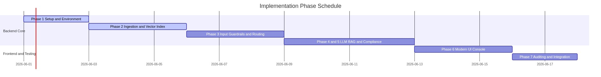
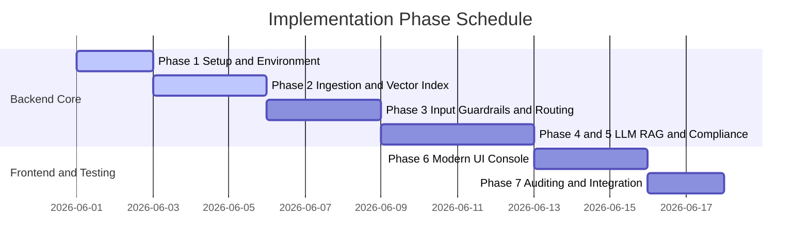

# Developer Implementation Plan: Mutual Fund FAQ Assistant

This document outlines the step-by-step roadmap for building the compliance-first Mutual Fund FAQ Assistant RAG system, aligning the developer's execution tasks with the system specifications detailed in [architecture.md](architecture.md).

---

## 1. High-Level Concept

The system serves as a **facts-only assistant** representing the **Groww** product context. It retrieves facts about 13 target schemes (like exit loads or expense ratios) and strictly refuses to give investment advice.

The assistant runs on two simple core pipelines:
1. **Offline Ingestion (Daily Scheduled)**: A scheduler runs once a day to pull raw facts, clean them, chunk them, and save them in a local Vector Database index.
2. **Online Query (On-Demand)**: When a user types a query, the system filters out personal info (PII), resolves spelling typos, checks if they are asking for advice, retrieves facts from the database, calls the LLM, and validates the answer format.

---

## 2. Target Configurations & Scope

### 2.1. Supported Schemes (13 Target Funds)
The pipeline retrieves facts exclusively from official factsheets and SIDs for:
*   *Axis Silver FoF, Axis Small Cap, and Axis Liquid Direct Funds*
*   *LIC MF Index Fund Nifty and LIC MF Children's Funds*
*   *Baroda BNP Paribas Large & Mid Cap and Baroda BNP Paribas Multi Asset Funds*
*   *Quantum ESG Strategy, Quantum Ethical, and Quantum Dynamic Bond Funds*
*   *Zerodha Overnight and Zerodha Nifty 50 Index Funds*
*   *Aditya Birla Sun Life Gold Fund*

### 2.2. Compliance Refusal Links
*   **Advisory Queries** (e.g. *"should I buy..."*): Returns a static refusal redirecting to the [SEBI Investor Association Guide](https://www.sebi.gov.in/sebiweb/other/OtherAction.do?doSubInvestortab=yes).
*   **Out-of-Domain Queries** (e.g. unrelated questions): Redirects to the [AMFI India Investor Corner](https://www.amfiindia.com/investor-corner).
*   **Performance Queries** (e.g. return rates): Redirects the user directly to the official factsheet source URL.

### 2.3. API Contract Schema
The server exposes `POST /api/chat`, accepting and returning the following schemas:
*   **Request JSON**:
    ```json
    { "message": "What is the exit load of Axis Small Cap?" }
    ```
*   **Response JSON (Factual)**:
    ```json
    {
      "answer": "The exit load of Axis Small Cap Fund Direct Growth is 1% if redeemed within 12 months.",
      "citation_url": "https://groww.in/mutual-funds/axis-small-cap-fund-direct-growth",
      "last_updated": "2026-05-29",
      "is_refusal": false,
      "disclaimer": "Facts-only. No investment advice."
    }
    ```
*   **Response JSON (Refusal)**:
    ```json
    {
      "answer": "I am a facts-only mutual fund assistant and cannot provide investment recommendations, advice, or buy/sell suggestions. For official investor education, please refer to the SEBI Investor Education page.",
      "citation_url": "https://www.sebi.gov.in/sebiweb/other/OtherAction.do?doSubInvestortab=yes",
      "last_updated": "2026-05-29",
      "is_refusal": true,
      "disclaimer": "Facts-only. No investment advice."
    }
    ```

### 2.4. Non-Functional & Security Baselines
*   **Latency Threshold**: $p95 < 5.0$ seconds end-to-end response time.
*   **Stateless Processing**: Request routing operates strictly in-memory without persistence or identifying session caches.
*   **Rate Limiting**: Implement basic rate-limiting controls on the API to prevent cost overruns and abuse.

---

## 3. Phase-Wise Implementation Roadmap



<details>
<summary><b>View Implementation Phase Schedule (Alternative Links / Mermaid Code)</b></summary>

*   **Relative Path**: [implementation_gantt.png](../images/implementation_gantt.png)
*   **Absolute Path**: [implementation_gantt.png](file:///C:/AS/PM/Projects/Mutual%20Fund-FAQ/images/implementation_gantt.png)
*   **Vector SVG**: [implementation_gantt.svg](../images/implementation_gantt.svg)


</details>

### Phase 1: Project Setup & Baseline Environment
Configure the project workspace, directories, and package configuration.
*   **Goal**: Establish folders, configure dependencies (Express, CORS, dotenv), and set up environment configs.
*   **Checklist**:
    *   [x] Run `npm init` and configure `"type": "module"` in `package.json`.
    *   [x] Set up folders (`src`, `public`, `data/corpus`, `data/db`).
    *   [x] Store Groq API key and base settings in a local `.env` file.
*   **Result**: Empty skeleton ready to run.

### Phase 2: Offline Ingestion & Vector Indexing
Implement the daily scheduler and database storage for scheme facts using a customized chunking strategy.
*   **Goal**: Process raw facts from the scheme corpus and store them as vector search chunks.
*   **Chunking Strategy**:
    *   **Section-Aware Segmentation**: Segment the JSON document strictly by its pre-structured topic boundaries (`sections`), yielding exactly 1 chunk per section to ensure zero cross-section query pollution.
    *   **Context Prepending**: Prepend the canonical `Scheme Name` and `Section Title` to the content text (e.g. `Scheme: <name>\nSection: <title>\nContent: <content>`) to force keyword alignment and anchor LLM prompt context during cosine similarity computations.
    *   **Metadata Enrichment**: Inherit parent metadata fields (`source_url`, `last_updated`, `scheme_name`, `chunk_id`) for precise scheme-filtering and response citation footers.
*   **Checklist**:
    *   [x] Store raw scheme facts in `data/corpus/schemes_data.json`.
    *   [x] Build `vector_db.js` supporting cosine similarity and Reciprocal Rank Fusion (RRF).
    *   [x] Implement `ingestion.js` to parse paragraphs/tables and save the index file using the section-aware chunking strategy.
    *   [x] Implement `scheduler.js` to trigger ingestion on startup and every 24 hours.
*   **Result**: Locally saved database index containing 91 factual chunks.

### Embedding Model

The system now uses the open‑source **BGE** embedding model (large) via the `@xenova/transformers` library. The model can be switched to `bge-small` by setting the environment variable `EMBED_MODEL` to `bge-small`. The dense vectors are stored in each chunk under the new `embedding` field while preserving the existing `tf` term‑frequency data for hybrid search.
### Retrieval Strategy – Hybrid Dense + Sparse (RRF)

**Goal**
Combine semantic similarity (dense BGE embeddings) with exact‑keyword matching (BM25 / TF‑IDF) to surface the most relevant factual chunks while preserving compliance guarantees.

**Approach**
1. Query embedding – encode the user query with the same BGE model used for chunk embeddings.
2. Dense ranking – cosine similarity between the query embedding and each chunk’s `embedding`.
3. Sparse ranking – BM25‑style overlap using the existing `tf` vectors.
4. Reciprocal Rank Fusion (RRF) – each ranking contributes `1/(k + rank)` (k = 60); scores are summed and top‑K results returned.
5. Faceting – if a scheme name is resolved, filter candidates to that scheme before ranking.

**Why RRF?**
It balances the strengths of both modalities: dense vectors capture paraphrasing, while sparse scores reward precise terminology (e.g., exact percentages, section headers). This hybrid approach meets the compliance‑first requirement by reducing false positives and ensuring citations are always present.

**Implementation notes**
- Add a `searchHybrid` async method to `VectorDB` (see code changes in `src/vector_db.js`).
- Update `processFactualQuery` in `src/llm.js` to call `db.searchHybrid` instead of `db.search`.
- The method re‑uses the existing `cosineSimilarity`, `bm25OverlapScore`, and tokenisation utilities.

### Vector Store Migration – ChromaDB

**Goal**
Replace the current file‑based `VectorDB` with a persistent ChromaDB collection that stores the dense BGE embeddings.

**User Review Required**
- Approve full migration to ChromaDB (JSON index will be kept only as backup).
- Decide whether to keep existing TF‑IDF (`tf`) data for hybrid BM25‑+‑dense search.
- Choose Chroma storage mode:
  - `persist_directory: "./data/chroma"` (recommended) – on‑disk persistence.
  - In‑memory only – for quick prototyping.

**Open Questions**
> **IMPORTANT**
> 1. Should the old `vector_db.js` be retained as fallback or removed?
> 2. Use a single collection for all schemes or one per scheme?
> 3. Keep hybrid search (BM25 + dense) or rely solely on ANN scores?

**Proposed Changes**

---
- **Add Dependency** `chromadb` to `package.json`.
- **Create** `src/chroma_client.js` exposing `addChunks`, `search`, `clear`.
- **Refactor** `src/vector_db.js` into an adapter that forwards to `chroma_client.js` (optionally keeping TF‑IDF helpers).
- **Update Ingestion** (`src/ingestion.js`) to compute BGE embeddings and store them via the new client, preserving metadata and optional `tf`.
- **Persistence**: Chroma writes its index to `data/chroma/`; keep `vector_index.json` as read‑only backup.

**Verification Plan**
- Run a quick ingest of a subset and query via the API; ensure results contain correct `scheme_name` and citations.
- Measure latency (< 200 ms) and confirm vectors are persisted across restarts.


### Phase 3: Input Guardrails & Query Routing
Build the PII shielding, entity resolution, and intent classifiers.
*   **Goal**: Redact sensitive data and route queries to the correct response path.
*   **Checklist**:
    *   [x] Build regex redactors in `guardrails.js` for PAN, Aadhaar, account numbers, email, and phone.
    *   [x] Write a Levenshtein-based fuzzy matcher to map misspelled queries (e.g. *"Axiz Small Cap"*) to correct scheme names.
    *   [x] Build the intent classifier to flag factual, advisory, performance, and out-of-domain scopes.
*   **Result**: Input queries sanitized and routed appropriately.

### Phase 4 & 5: LLM Execution & Compliance Guard
Send RAG prompts to the LLM and run output validators before displaying answers.
*   **Goal**: Fetch factual answers from the LLM and block compliance errors.
*   **Checklist**:
    *   [x] Connect server to Groq API using Llama-3.3-70b.
    *   [x] Inject strict system instructions (max 3 sentences, 1 citation link).
    *   [x] Write output validation checks (flag responses > 3 sentences or lacking target URL).
    *   [x] Write fallback handlers to display a safe verification link if the LLM fails validation.
*   **Result**: Validated, citation-backed answers delivered safely.

### Phase 6: Modern UI Console
Create the front-end interface for user interaction.
*   **Goal**: Build a responsive chat application with modern dark-slate styles and pipeline animations.
*   **Checklist**:
    *   [x] Create `index.html` with a sticky disclaimer banner and example query cards.
    *   [x] Style using Inter/Outfit typography, glassmorphism headers, and button transitions.
    *   [x] Connect client requests and animate step-by-step pipeline stages (PII Shield → Intent Classifier → Vector Search → LLM API → Compliance Guard).
*   **Result**: Visual, interactive frontend dashboard.

### Phase 7: Auditing & Integration Tests
Perform compliance validations on all pipelines.
*   **Goal**: Execute test queries to verify sanitization, refusal redirects, and RAG constraints.
*   **Checklist**:
    *   [x] Verify PII triggers redact PAN and Aadhaar values successfully.
    *   [x] Test advisory queries route to SEBI portal.
    *   [x] Test performance queries bypass LLM and route to factsheet URLs.
    *   [x] Confirm factual answers are under 3 sentences and cite correct URLs.
*   **Result**: Audited and compliant deployment-ready codebase.
